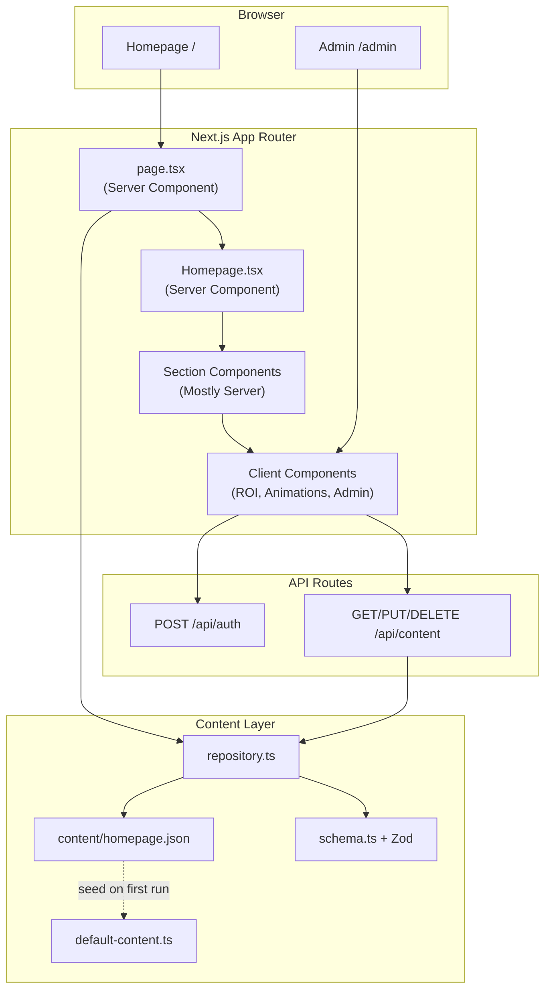
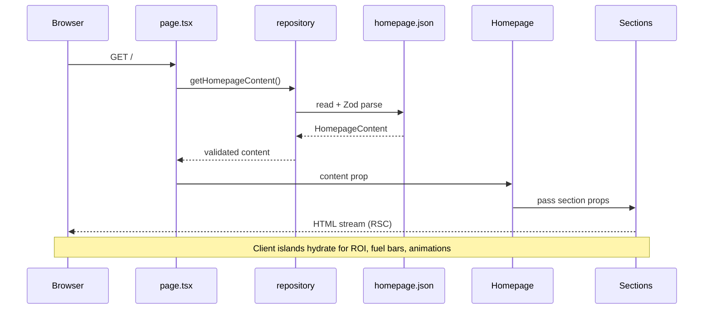
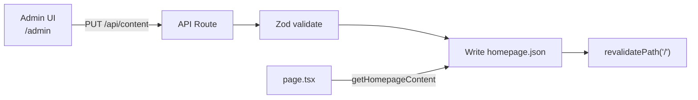
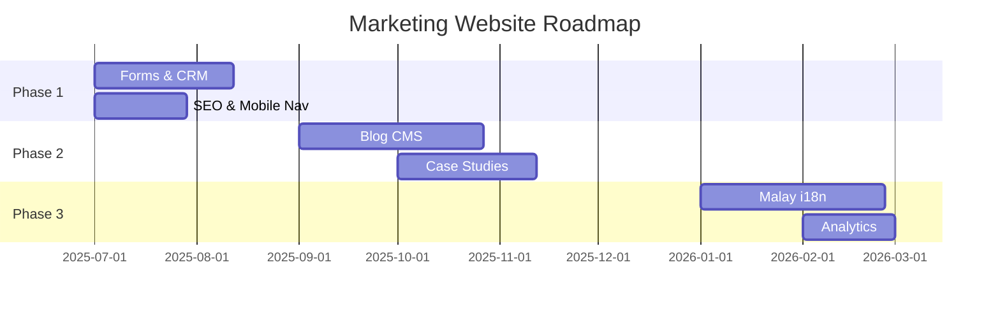

# TCMS.ai Marketing Website — Developer Handoff

**Version:** 1.0  
**Last updated:** June 2025  
**Application path:** `web/`  
**Production URL (target):** `https://tcms.ai` (configure at deploy time)

This document is the single source of truth for developers taking over the TCMS.ai marketing website. It describes purpose, architecture, CMS fields, design system, components, deployment, and troubleshooting. No verbal handoff is required if you read this document end-to-end.

---

## Table of Contents

1. [Overview](#1-overview)
2. [Architecture](#2-architecture)
3. [Folder Structure](#3-folder-structure)
4. [CMS Guide](#4-cms-guide)
5. [Design System](#5-design-system)
6. [Component Documentation](#6-component-documentation)
7. [Responsive Design Rules](#7-responsive-design-rules)
8. [SEO Documentation](#8-seo-documentation)
9. [Performance Documentation](#9-performance-documentation)
10. [Future Enhancements](#10-future-enhancements)
11. [Maintenance Guide](#11-maintenance-guide)
12. [Troubleshooting](#12-troubleshooting)
13. [Build Verification](#13-build-verification)
14. [Solution Pages](#14-solution-pages)

---

## 1. Overview

### 1.1 Purpose

The TCMS.ai marketing website is a **conversion-focused landing page** for a Transportation Management System (TMS) built specifically for the Malaysian logistics market. It communicates product value, builds trust with fleet operators, and drives prospects toward demo bookings and sales conversations.

The site is **not** the product application itself. It is a standalone marketing surface that:

- Explains TCMS.ai capabilities (GPS, fuel, compliance, customer portal, invoicing)
- Addresses pain points familiar to Malaysian transport operators
- Showcases pricing and social proof
- Provides an interactive ROI calculator for lead engagement

### 1.2 Target Audience

| Segment | Needs addressed on site |
|---------|-------------------------|
| **Fleet owners** | Visibility, fuel savings, compliance (APAD/JPJ) |
| **Transport operators** | Dispatch chaos, WhatsApp/Excel workflows, delayed invoicing |
| **Logistics companies** | Customer shipment visibility, scalable pricing |
| **Operations managers** | Live GPS, maintenance, driver compliance |

Primary geography: **Malaysia**. Copy references APAD, JPJ, RM currency, and local logistics context.

### 1.3 Conversion Goals

| Goal | Primary CTAs on site | Current state |
|------|---------------------|---------------|
| **Book Demo** | Header "Book Demo", Hero "Book Live Demo", Final CTA | Buttons render; no form/backend yet |
| **Contact Sales** | Pricing "Contact Sales" (Enterprise plan) | Button only |
| **Lead Capture** | ROI Calculator "Get Detailed ROI Report" | Interactive calculator; no submission yet |

> **Note:** CTA buttons are presently presentational. Phase 1 roadmap covers wiring forms and CRM integration (see [Section 10](#10-future-enhancements)).

### 1.4 Technology Summary

| Layer | Technology |
|-------|------------|
| Framework | Next.js 16.2 (App Router) |
| Language | TypeScript 5 |
| Styling | Tailwind CSS v4 (`@theme inline` tokens) |
| Validation | Zod 4 |
| CMS | File-based JSON + `/admin` panel |
| Fonts | Inter (next/font), Material Symbols Outlined (CDN) |
| Images | next/image with remote Googleusercontent allowlist |

---

## 2. Architecture

### 2.1 High-Level System Diagram



### 2.2 Next.js App Router Structure

```
web/src/app/
├── layout.tsx          # Root layout, Inter font, global CSS
├── page.tsx            # Homepage route — fetches CMS content
├── globals.css         # Tailwind v4 theme tokens + animations
├── admin/
│   └── page.tsx        # CMS admin (server auth gate + client editor)
└── api/
    ├── auth/route.ts   # CMS login/logout
    └── content/route.ts # CMS read/write/reset
```

**Routing conventions:**

- `/` — Statically generated at build time; revalidated on CMS save via `revalidatePath("/")`
- `/solutions/accounting-payments` — Accounting & payments solution page (static)
- `/solutions/fleet-maintenance` — Fleet maintenance solution page (static)
- `/solutions/payroll-compliance` — Payroll & compliance solution page (static)
- `/admin` — Dynamically rendered (`ƒ`) because it reads cookies for auth
- `/api/*` — Route handlers for CMS operations

### 2.3 Server Components vs Client Components

| Type | Rule | Examples in this project |
|------|------|--------------------------|
| **Server Component** (default) | No hooks, no browser APIs, can async/await data | `page.tsx`, `HeroSection`, `PricingSection`, `Header` |
| **Client Component** (`"use client"`) | Interactivity, hooks, browser APIs | `RoiCalculatorSection`, `FuelCostSection`, `AnimatedCounter`, `RevealOnScroll`, `CmsEditor` |

**Homepage rendering flow:**



### 2.4 CMS Architecture

The CMS is a **file-based content layer** with three parts:

1. **Schema** (`src/lib/content/schema.ts`) — Zod definitions for every field
2. **Repository** (`src/lib/content/repository.ts`) — Read/write `content/homepage.json`
3. **Admin UI** (`/admin`) — Password-protected editor for common fields



**Content flow on save:**

1. Admin edits fields in browser state
2. `PUT /api/content` sends full `HomepageContent` JSON
3. API validates session cookie + Zod schema
4. File written to `web/content/homepage.json`
5. `revalidatePath("/")` invalidates cached homepage
6. Next request serves updated content

**Fallback:** If `homepage.json` is missing, `default-content.ts` is written automatically on first read.

### 2.5 Authentication Model

- Password stored in env: `CMS_ADMIN_PASSWORD` (default: `tcms-admin-change-me`)
- Login: `POST /api/auth` with `{ password }` → sets httpOnly cookie `tcms_cms_session`
- Session: SHA-256 hash, 8-hour expiry, `sameSite: strict`
- Logout: `DELETE /api/auth` clears cookie

---

## 3. Folder Structure

All application code lives under `web/`. Repository root contains docs and reference assets.

```
newtcmswebsite/
├── docs/
│   └── MARKETING_WEBSITE.md     ← This document
├── reference/
│   └── code.html                ← Original static HTML mockup
├── README.md
└── web/                         ← Next.js application
    ├── content/
    │   └── homepage.json        ← Live CMS content (git-tracked or env-specific)
    ├── public/                  ← Static assets served at /
    ├── src/
    │   ├── app/                 ← Routes, layouts, API
    │   ├── components/
    │   │   ├── admin/           ← CMS login + editor
    │   │   ├── layout/          ← Header, Footer
    │   │   ├── sections/        ← Homepage sections
    │   │   ├── solutions/       ← Solution page components
    │   │   ├── ui/              ← Reusable primitives
    │   │   └── Homepage.tsx     ← Homepage orchestrator
    │   └── lib/
    │       ├── auth/
    │       ├── content/         ← schema, repository, solutions.ts
    │       └── utils/
    ├── .env.example
    ├── next.config.ts
    └── package.json
```

### 3.1 `src/app`

Next.js App Router entry points.

| File | Responsibility |
|------|----------------|
| `layout.tsx` | Root HTML shell, Inter font, Material Icons link, default metadata |
| `page.tsx` | Homepage route; `generateMetadata()` + `getHomepageContent()` |
| `solutions/accounting-payments/page.tsx` | Accounting & payments solution page |
| `solutions/fleet-maintenance/page.tsx` | Fleet maintenance solution page |
| `solutions/payroll-compliance/page.tsx` | Payroll & compliance solution page |
| `globals.css` | Design tokens, animations, utility classes |
| `admin/page.tsx` | Auth gate; renders `CmsLoginForm` or `CmsEditor` |
| `api/auth/route.ts` | CMS login/logout |
| `api/content/route.ts` | Public GET; authenticated PUT/DELETE |

### 3.2 `src/components/layout`

Site chrome shared across all pages.

| Component | CMS source | Notes |
|-----------|-----------|-------|
| `Header.tsx` | `content.navigation` + `solutionNavLinks` | Sticky nav with Solutions dropdown |
| `Footer.tsx` | `content.footer` | Multi-column link grid + copyright |

### 3.3 `src/components/solutions`

Reusable components for `/solutions/*` pages. These routes render **marketing product-preview dashboards** inside a Command Center shell — they are **not** authenticated app screens and do not connect to live data. Content is sourced from `solutions.ts`.

| Component | Purpose |
|-----------|---------|
| `CommandCenterShell.tsx` | Shared dashboard chrome: top nav, left sidebar (desktop), main content slot, footer slot |
| `CommandCenterFooter.tsx` | Page-specific footer columns inside the shell |
| `PreviewCard.tsx` | Rounded card wrapper for dashboard preview sections |
| `AccountingPaymentsPreview.tsx` | Accounting & payments dashboard mockup content |
| `FleetMaintenancePreview.tsx` | Fleet maintenance dashboard mockup content |
| `PayrollCompliancePreview.tsx` | Payroll & compliance dashboard mockup content |

**CommandCenterShell** props:

| Prop | Purpose |
|------|---------|
| `subtitle` | Sidebar subtitle (`LOGISTICS CORE` or `PRECISION LOGISTICS`) |
| `activeMenu` | Highlighted sidebar item (`finance`, `fleet`, etc.) |
| `showSecurity` | Show Security menu item (Fleet page only) |
| `apiLinkLabel` | Bottom sidebar link text (`API` or `API Docs`) |
| `children` | Page-specific preview content |
| `footer` | Footer rendered below main content |

Legacy generic layout components (`SolutionPage`, `SolutionHero`, etc.) remain in the folder but are no longer used by the three solution routes.

### 3.4 `src/components/sections`

One React component per homepage section. Each receives a typed slice of `HomepageContent`.

| File | Section ID (anchor) |
|------|---------------------|
| `HeroSection.tsx` | — |
| `PainPointsSection.tsx` | `#solutions` |
| `VisibilitySection.tsx` | `#platform` |
| `CustomerExperienceSection.tsx` | `#advantage` |
| `FuelCostSection.tsx` | — |
| `ComplianceSection.tsx` | — |
| `EcosystemSection.tsx` | — |
| `RoiCalculatorSection.tsx` | — |
| `SocialProofSection.tsx` | — |
| `PricingSection.tsx` | — |
| `FinalCtaSection.tsx` | `#contact` |

### 3.5 `src/components/ui`

Reusable design-system primitives.

| Component | Purpose |
|-----------|---------|
| `Section.tsx` | Wrapper with `py-16 md:py-20` and white/muted/primary variants |
| `SectionHeader.tsx` | Centered or left-aligned H2 + subtitle |
| `Container.tsx` | Max-width 1200px centered container with horizontal padding |
| `Card.tsx` | White card with border + shadow |
| `FeatureCard.tsx` | Icon + title + description (horizontal or stacked) |
| `MetricCard.tsx` | Large stat number + label |
| `Button.tsx` | Primary, secondary, outline, white variants; sm/md/lg sizes |
| `MaterialIcon.tsx` | Google Material Symbols wrapper |
| `RevealOnScroll.tsx` | Intersection Observer fade/scale animations |
| `AnimatedCounter.tsx` | Count-up animation for stats |

### 3.6 `src/components/admin`

| Component | Purpose |
|-----------|---------|
| `CmsLoginForm.tsx` | Password form → `POST /api/auth` |
| `CmsEditor.tsx` | Section-based editor; save → `PUT /api/content` |

**Admin-editable sections in UI:** metadata, navigation, hero, painPoints, pricing, finalCta, footer.

**JSON-only sections** (edit `content/homepage.json` directly): visibility, customerExperience, fuelCost, compliance, ecosystem, roiCalculator, socialProof.

### 3.7 `src/lib/content`

| File | Purpose |
|------|---------|
| `schema.ts` | Zod schemas + TypeScript types for all CMS fields |
| `default-content.ts` | Factory defaults matching original HTML mockup |
| `repository.ts` | `getHomepageContent`, `updateHomepageContent`, `resetHomepageContent` |

### 3.8 `src/lib/auth`

| File | Purpose |
|------|---------|
| `cms-auth.ts` | Password verification, session cookie create/validate/clear |

### 3.9 `content/`

Runtime CMS storage. **Single file:** `homepage.json`.

- Created automatically from `default-content.ts` if missing
- Must validate against `homepageContentSchema` on every read/write
- Safe to commit for staging; use env-specific copies in production if content diverges

### 3.10 `public/`

Static files served at site root. Currently contains default Next.js SVG placeholders only. **Marketing images are loaded from remote URLs** (Google CDN) defined in CMS content — add local assets here when migrating to self-hosted images.

---

## 4. CMS Guide

All content is defined in `homepage.json` under the root `HomepageContent` object. Types are enforced by Zod in `schema.ts`.

### 4.1 Admin Panel vs JSON Editing

| Method | Best for |
|--------|----------|
| `/admin` UI | Quick copy changes to hero, nav, pain points, pricing, CTA, footer, SEO |
| Direct JSON edit | All sections including visibility, fuel chart, testimonials, ecosystem |
| `DELETE /api/content` | Reset entire site to `default-content.ts` |

### 4.2 Field Reference

#### SEO — `metadata`

| Field | Controls | Appears | Example |
|-------|----------|---------|---------|
| `metadata.title` | Browser tab title, search result title | `<title>`, `generateMetadata()` | `TCMS.ai \| Run Your Entire Transport Business From One Place` |
| `metadata.description` | Meta description | `<meta name="description">` | `Track vehicles, manage trips, monitor fuel...` |

#### Navigation — `navigation`

| Field | Controls | Appears | Example |
|-------|----------|---------|---------|
| `navigation.brand` | Logo text | Header left | `TCMS.ai` |
| `navigation.links[]` | Nav menu items | Header center (desktop) | `{ label: "Solutions", href: "#solutions", isActive: true }` |
| `navigation.links[].isActive` | Active underline styling | Header | `true` for current section |
| `navigation.loginLabel` | Login link text | Header right | `Login` |
| `navigation.cta.label` | Primary header button | Header right | `Book Demo` |

#### Hero — `hero`

| Field | Controls | Appears | Example |
|-------|----------|---------|---------|
| `hero.headline` | H1 first line | Hero left | `Run Your Entire Transport Business From` |
| `hero.headlineHighlight` | Blue highlighted text | Hero H1 | `One Place.` |
| `hero.description` | Subheading paragraph | Hero left | `Track vehicles, manage trips...` |
| `hero.primaryCta.label` | Primary button text | Hero | `Book Live Demo` |
| `hero.secondaryCta.label` | Secondary button text | Hero | `Watch 2-Minute Demo` |
| `hero.image.src` | Hero image URL | Hero right | `https://lh3.googleusercontent.com/...` |
| `hero.image.alt` | Image alt text | Hero (accessibility) | `Modern heavy-duty logistics prime movers...` |
| `hero.trustBadges[]` | Trust bar items | Below hero grid | `{ icon: "location_on", label: "GPS Tracking" }` |

#### Pain Points — `painPoints`

| Field | Controls | Appears | Example |
|-------|----------|---------|---------|
| `painPoints.title` | Section H2 | `#solutions` | `Still Managing Your Fleet Through Calls, WhatsApp and Excel?` |
| `painPoints.subtitle` | Section subtitle | `#solutions` | `Manual operations lead to hidden costs...` |
| `painPoints.items[]` | Problem cards (6 recommended) | 3-col grid | `{ icon: "phone_disabled", title: "...", description: "..." }` |
| `painPoints.ctaBanner.title` | Blue strip headline | Full-width CTA bar | `TCMS.ai Solves All Of These` |
| `painPoints.ctaBanner.cta.label` | Blue strip button | Full-width CTA bar | `See How It Works` |

**Icon names** use [Google Material Symbols](https://fonts.google.com/icons) (snake_case).

#### GPS Visibility — `visibility`

| Field | Controls | Appears | Example |
|-------|----------|---------|---------|
| `visibility.title` | H2 first part | `#platform` | `Know Where Every Vehicle Is.` |
| `visibility.titleHighlight` | Blue highlight | `#platform` | `Right Now.` |
| `visibility.image` | Product mockup | Left column | Dashboard map screenshot URL |
| `visibility.features[]` | 2×2 feature grid | Right column | `{ icon: "radar", title: "Live GPS Tracking", description: "..." }` |

#### Customer Visibility — `customerExperience`

| Field | Controls | Appears | Example |
|-------|----------|---------|---------|
| `customerExperience.title` | Section H2 | `#advantage` | `Give Your Customers Amazon-Like Shipment Visibility` |
| `customerExperience.subtitle` | Tagline | `#advantage` | `"Fewer calls. More trust. More repeat business."` |
| `customerExperience.features[]` | Left feature cards | 3 stacked cards | Live Shipment Tracking, WhatsApp, Digital POD |
| `customerExperience.shipment.id` | Shipment ID header | Portal preview card | `Shipment #MY-982314` |
| `customerExperience.shipment.status` | Status badge | Portal preview | `IN TRANSIT` |
| `customerExperience.shipment.steps[]` | Timeline steps | Portal preview | `{ status: "completed"\|"active"\|"pending", title, subtitle }` |

#### Fuel Savings — `fuelCost`

| Field | Controls | Appears | Example |
|-------|----------|---------|---------|
| `fuelCost.title` | Section H2 | Fuel section | `Stop Losing Money On Fuel` |
| `fuelCost.features[]` | Left feature list | 3 items | Fuel Theft Detection, Idle Time, Trip Profitability |
| `fuelCost.chart.title` | Chart heading | Right card | `Monthly Fuel Spend Per Fleet (RM)` |
| `fuelCost.chart.bars[]` | Bar chart data | Animated bars | `{ label: "Manual Mgmt", value: "RM 45,000", heightPercent: 100, variant: "manual" }` |
| `fuelCost.chart.savingsLabel` | Green callout | Below chart | `Estimated Savings: 30%` |

> `heightPercent` controls bar height (0–100). TCMS bar is typically ~70% of manual bar.

#### Compliance — `compliance`

| Field | Controls | Appears | Example |
|-------|----------|---------|---------|
| `compliance.title` | Section H2 | Compliance grid | `Built For Malaysian Transport Operations` |
| `compliance.subtitle` | Subtitle | Compliance grid | `We understand local regulations...` |
| `compliance.items[]` | 4 cards | 4-col grid | APAD Integration, JPJ Support, Driver Compliance, Permit Mgmt |

#### Ecosystem — `ecosystem`

| Field | Controls | Appears | Example |
|-------|----------|---------|---------|
| `ecosystem.title` | Section H2 | Core hub diagram | `Everything Connected` |
| `ecosystem.subtitle` | Subtitle | Core hub diagram | `The central brain of your logistics operation.` |
| `ecosystem.hubLabel` | Center card title | Blue hub card | `TCMS.ai` |
| `ecosystem.hubSublabel` | Center card subtitle | Blue hub card | `CORE HUB` |
| `ecosystem.nodes[]` | Surrounding cards (4 expected) | Connected nodes | Vehicles, Drivers, Customers, Accounting |

**Node order matters:** `[0]` left, `[1]` right, `[2]` top, `[3]` bottom.

#### ROI Calculator — `roiCalculator`

| Field | Controls | Appears | Example |
|-------|----------|---------|---------|
| `roiCalculator.title` | Card header | Blue header bar | `Calculate Your Estimated Savings` |
| `roiCalculator.fleetSizeDefault` | Initial slider value | Fleet size input | `50` |
| `roiCalculator.fuelSpendPlaceholder` | Fuel input placeholder | Number input | `RM 50,000` |
| `roiCalculator.adminHoursPlaceholder` | Admin hours placeholder | Number input | `40` |
| `roiCalculator.results.*` | Result labels | Results panel | Fuel savings, admin time, collection labels |
| `roiCalculator.cta.label` | Submit button | Results panel | `Get Detailed ROI Report` |

**Calculator logic (client-side, hardcoded):**

```typescript
fuelSavings = fleetSize * 150        // RM
adminHours  = Math.round(fleetSize * 1.3)
collectionDays = 12                  // fixed
```

To change formulas, edit `RoiCalculatorSection.tsx`.

#### Social Proof — `socialProof`

| Field | Controls | Appears | Example |
|-------|----------|---------|---------|
| `socialProof.stats[]` | Metric cards | 3-col row | `{ value: 12000, suffix: "+", label: "Vehicles Managed" }` |
| `socialProof.stats[].decimals` | Decimal places in counter | Animated number | `1` for `1.5M+` |
| `socialProof.testimonials[]` | Quote cards | 2-col grid | quote, name, role, avatar |

#### Pricing — `pricing`

| Field | Controls | Appears | Example |
|-------|----------|---------|---------|
| `pricing.title` | Section H2 | Pricing | `Simple, Transparent Pricing` |
| `pricing.subtitle` | Subtitle | Pricing | `Plans that scale with your transport business.` |
| `pricing.plans[]` | Pricing cards | 3-col grid | Starter, Growth, Enterprise |
| `plans[].isFeatured` | Highlight middle card | Growth plan | `true` |
| `plans[].badge` | Top badge text | Featured card | `MOST POPULAR` |
| `plans[].features[]` | Feature checklist | Each card | `{ label: "Live GPS Tracking", included: true }` |
| `plans[].cta` | Plan button | Card footer | `{ label: "Choose Growth", variant: "primary" }` |

#### Final CTA — `finalCta`

| Field | Controls | Appears | Example |
|-------|----------|---------|---------|
| `finalCta.title` | H2 on blue background | `#contact` | `Ready To Grow Your Transport Business?` |
| `finalCta.description` | Supporting text | `#contact` | `Join 500+ Malaysian transport companies...` |
| `finalCta.cta.label` | White button text | `#contact` | `Book Live Demo Now` |
| `finalCta.footnote` | Small print | `#contact` | `No credit card required. Setup in less than 48 hours.` |

#### Footer — `footer`

| Field | Controls | Appears | Example |
|-------|----------|---------|---------|
| `footer.brand` | Brand name | Footer column 1 | `TCMS.ai` |
| `footer.description` | Brand blurb | Footer column 1 | `The leading transportation management system...` |
| `footer.columns[]` | Link columns | Footer grid | Product, Company, Resources, Legal |
| `footer.copyright` | Copyright line | Footer bottom | `© 2024 TCMS.ai...` |
| `footer.socialIcons[]` | Material icon names | Footer bottom right | `["face_nod", "linked_camera", "mail"]` |

### 4.3 JSON Edit Example

To add a testimonial, append to `socialProof.testimonials`:

```json
{
  "quote": "TCMS.ai reduced our dispatch calls by 80%.",
  "name": "Ahmad Razak",
  "role": "Operations Director, Penang Freight",
  "avatar": {
    "src": "https://example.com/avatar.jpg",
    "alt": "Portrait of Ahmad Razak"
  }
}
```

Validate by running `npm run build` — Zod parse errors will fail the build if content is fetched at build time with invalid JSON.

---

## 5. Design System

Design tokens live in `web/src/app/globals.css` under `@theme inline`.

### 5.1 Color Palette

| Token | Hex | Usage |
|-------|-----|-------|
| `primary` | `#003B8F` | Buttons, headings accent, hub card, CTA sections |
| `primary-dark` | `#002D6E` | Button hover states |
| `primary-light` | `#E8F0FB` | Icon backgrounds (optional) |
| `secondary` | `#059669` | Success badges, savings highlights |
| `error` | `#DC2626` | Pain point icons |
| `section-muted` | `#F8FAFC` | Alternating section backgrounds |
| `on-surface` | `#0F172A` | Primary text (slate-900 equivalent) |
| `on-surface-variant` | `#475569` | Body text (slate-600 equivalent) |
| `outline-variant` | `#E2E8F0` | Borders |

**Tailwind usage:** `bg-primary`, `text-slate-600`, `border-slate-200/80`

### 5.2 Typography Scale

| Element | Classes | Size |
|---------|---------|------|
| Hero H1 | `text-4xl sm:text-5xl lg:text-[3.25rem] font-bold` | 36–52px |
| Section H2 | `text-3xl md:text-4xl font-bold tracking-tight` | 30–36px |
| Card title | `text-lg font-semibold` | 18px |
| Body | `text-base md:text-lg text-slate-600` | 16–18px |
| Label/caps | `text-xs font-bold uppercase tracking-wider` | 12px |
| Metric | `text-4xl md:text-5xl font-bold text-primary` | 36–48px |

**Font family:** Inter via `next/font/google` (`--font-inter`).

**Icons:** Material Symbols Outlined via CDN in `layout.tsx`.

### 5.3 Container Widths

| Token | Value | Usage |
|-------|-------|-------|
| `max-w-container-max` | `75rem` (1200px) | All page content |
| ROI calculator | `max-w-4xl` (896px) | Narrower focused card |
| Ecosystem diagram | `max-w-3xl` (768px) | Hub visualization |

**Horizontal padding:** `px-5 sm:px-6 lg:px-8` via `Container` component.

### 5.4 Section Spacing

| Rule | Value |
|------|-------|
| Section vertical padding | `py-16` mobile, `md:py-20` desktop |
| Section header bottom margin | `mb-12 md:mb-16` |
| Grid gaps | `gap-5` / `gap-6` / `lg:gap-8` depending on section |
| Hero top padding | `pt-28 md:pt-32 lg:pt-36` (clears fixed header) |

Use the `Section` component to enforce consistent spacing:

```tsx
<Section variant="muted">
  <SectionHeader title="..." subtitle="..." />
  {/* content */}
</Section>
```

### 5.5 Border Radius

| Element | Radius |
|---------|--------|
| Buttons | `rounded-xl` (lg), `rounded-lg` (sm) |
| Cards | `rounded-2xl` |
| Icon containers | `rounded-xl` |
| Badges/pills | `rounded-full` |
| Images | `rounded-2xl` |

### 5.6 Shadow Standards

| Class | Usage |
|-------|-------|
| `shadow-card` | Default card elevation |
| `shadow-card-hover` | Hover state, featured cards |
| `shadow-btn` | Primary buttons |
| `shadow-btn-hover` | Button hover |
| `shadow-image` | Hero/product images |

Defined as CSS variables in `globals.css`.

### 5.7 Card Patterns

**Standard card:**

```tsx
<div className="rounded-2xl border border-slate-200/80 bg-white p-6 shadow-card">
  {/* content */}
</div>
```

Or use `<Card padding="md" hover />` from `components/ui/Card.tsx`.

**Feature card:** `<FeatureCard icon="radar" title="..." description="..." />`

**Metric card:** `<MetricCard value="12,000+" label="Vehicles Managed" />`

### 5.8 CTA Patterns

| Variant | Component prop | Visual |
|---------|---------------|--------|
| Primary | `variant="primary" size="lg"` | Blue fill, white text, shadow |
| Secondary | `variant="secondary" size="lg"` | White fill, slate border |
| Outline | `variant="outline"` | Blue border, transparent fill |
| On blue bg | `variant="white" size="lg"` | White fill, blue text |

All buttons support optional `pulse` prop for subtle animation.

---

## 6. Component Documentation

### 6.1 Layout Components

#### `Header`

| | |
|-|-|
| **Purpose** | Fixed top navigation with brand, links, login, CTA |
| **Props** | `{ navigation: HomepageContent["navigation"] }` |
| **CMS** | `content.navigation` |
| **Responsive** | Nav links hidden below `lg`; login hidden below `md`; CTA always visible |

#### `Footer`

| | |
|-|-|
| **Purpose** | Site footer with brand, link columns, copyright, social icons |
| **Props** | `{ footer: HomepageContent["footer"] }` |
| **CMS** | `content.footer` |
| **Responsive** | 2-col → 4-col → 6-col grid at breakpoints |

### 6.2 Section Components

#### `HeroSection`

| | |
|-|-|
| **Purpose** | Above-the-fold value proposition with image and trust bar |
| **Props** | `{ hero: HomepageContent["hero"] }` |
| **CMS** | `content.hero` |
| **Responsive** | Single column mobile; 2-col at `lg`; CTAs stack on mobile |

#### `PainPointsSection`

| | |
|-|-|
| **Purpose** | Problem agitation + full-width solution CTA strip |
| **Props** | `{ painPoints: HomepageContent["painPoints"] }` |
| **CMS** | `content.painPoints` |
| **Responsive** | 1 → 2 → 3 column card grid; CTA strip stacks on mobile |

#### `VisibilitySection`

| | |
|-|-|
| **Purpose** | GPS/product mockup + feature grid |
| **Props** | `{ visibility: HomepageContent["visibility"] }` |
| **CMS** | `content.visibility` (JSON only) |
| **Responsive** | Image below text on mobile (`order-2 lg:order-1`) |

#### `CustomerExperienceSection`

| | |
|-|-|
| **Purpose** | Customer portal features + shipment tracking preview |
| **Props** | `{ customerExperience: HomepageContent["customerExperience"] }` |
| **CMS** | `content.customerExperience` (JSON only) |
| **Responsive** | 5-col grid collapses to stacked layout |

#### `FuelCostSection` *(Client Component)*

| | |
|-|-|
| **Purpose** | Fuel features + animated comparison bar chart |
| **Props** | `{ fuelCost: HomepageContent["fuelCost"] }` |
| **CMS** | `content.fuelCost` (JSON only) |
| **Responsive** | 2-col → stacked; chart full width on mobile |

#### `ComplianceSection`

| | |
|-|-|
| **Purpose** | Malaysian regulatory compliance cards |
| **Props** | `{ compliance: HomepageContent["compliance"] }` |
| **CMS** | `content.compliance` (JSON only) |
| **Responsive** | 1 → 2 → 4 column grid |

#### `EcosystemSection`

| | |
|-|-|
| **Purpose** | Visual hub-and-spoke integration diagram |
| **Props** | `{ ecosystem: HomepageContent["ecosystem"] }` |
| **CMS** | `content.ecosystem` (JSON only) |
| **Responsive** | Vertical stack mobile; absolute positioning desktop |

#### `RoiCalculatorSection` *(Client Component)*

| | |
|-|-|
| **Purpose** | Interactive ROI estimator with live calculations |
| **Props** | `{ roiCalculator: HomepageContent["roiCalculator"] }` |
| **CMS** | Labels/placeholders from CMS; formulas in component |
| **Responsive** | 2-col form/results → stacked on mobile |

#### `SocialProofSection`

| | |
|-|-|
| **Purpose** | Stats counters + customer testimonials |
| **Props** | `{ socialProof: HomepageContent["socialProof"] }` |
| **CMS** | `content.socialProof` (JSON only) |
| **Responsive** | 3 metric cards stack; 2 testimonials stack |

#### `PricingSection`

| | |
|-|-|
| **Purpose** | Three-tier pricing comparison |
| **Props** | `{ pricing: HomepageContent["pricing"] }` |
| **CMS** | `content.pricing` |
| **Responsive** | 1 → 3 columns; featured card scales up on desktop |

#### `FinalCtaSection`

| | |
|-|-|
| **Purpose** | Bottom conversion block on primary blue background |
| **Props** | `{ finalCta: HomepageContent["finalCta"] }` |
| **CMS** | `content.finalCta` |
| **Responsive** | Centered single column all breakpoints |

### 6.3 UI Primitives

See [Section 3.4](#34-srccomponentsui) for the full list. Key patterns:

- **`RevealOnScroll`** — Wraps content for scroll-triggered animation; respects `prefers-reduced-motion`
- **`AnimatedCounter`** — Client-only count-up; starts at 0 to avoid hydration mismatch (value updates after mount)
- **`StaggerReveal` / `StaggerItem`** — Sequential animation delays for grid children

### 6.4 `Homepage` Orchestrator

```tsx
// src/components/Homepage.tsx
export function Homepage({ content }: { content: HomepageContent }) {
  return (
    <>
      <Header navigation={content.navigation} />
      <main>
        <HeroSection hero={content.hero} />
        {/* ... all sections in order ... */}
      </main>
      <Footer footer={content.footer} />
    </>
  );
}
```

Section order is fixed here. To reorder sections, edit this file.

---

## 7. Responsive Design Rules

### 7.1 Breakpoints (Tailwind v4 defaults)

| Prefix | Min width | Typical use |
|--------|-----------|-------------|
| (none) | 0px | Mobile-first base styles |
| `sm` | 640px | Small tablets, horizontal CTAs |
| `md` | 768px | 2-column grids, show login |
| `lg` | 1024px | Desktop nav, 3-col grids, 2-col heroes |
| `xl` | 1280px | Wider spacing (rarely used) |

### 7.2 Grid Behavior

| Section | Mobile | Tablet (`md`) | Desktop (`lg`) |
|---------|--------|---------------|----------------|
| Pain points | 1 col | 2 col | 3 col |
| Visibility | stacked | stacked | 2 col |
| Customer experience | stacked | stacked | 5-col (2+3) |
| Fuel | stacked | stacked | 2 col |
| Compliance | 1 col | 2 col | 4 col |
| Social proof stats | 1 col | 3 col | 3 col |
| Pricing | 1 col | 1 col | 3 col |

### 7.3 Card Stacking

All multi-column grids use `grid` with responsive column classes. Cards use `h-full` + `flex flex-col` where equal heights are required (pain points, pricing).

### 7.4 Navigation Behavior

| Viewport | Behavior |
|----------|----------|
| `< lg` | Hamburger **not implemented** — nav links hidden; brand + CTA visible |
| `≥ lg` | Full horizontal nav with active underline |
| All | Header fixed with `backdrop-blur-md` |

> **Gap:** Mobile hamburger menu is a recommended Phase 1 enhancement.

---

## 8. SEO Documentation

### 8.1 Metadata Handling

**Homepage** uses dynamic metadata from CMS:

```typescript
// src/app/page.tsx
export async function generateMetadata(): Promise<Metadata> {
  const content = await getHomepageContent();
  return {
    title: content.metadata.title,
    description: content.metadata.description,
  };
}
```

**Root layout** provides fallback defaults:

```typescript
// src/app/layout.tsx
export const metadata: Metadata = {
  title: "TCMS.ai",
  description: "Run your entire transport business from one place.",
};
```

Page-level metadata overrides layout defaults for `/`.

### 8.2 OpenGraph

**Current state:** Not configured. `generateMetadata()` does not set `openGraph` or `twitter` fields.

**Recommended addition:**

```typescript
return {
  title: content.metadata.title,
  description: content.metadata.description,
  openGraph: {
    title: content.metadata.title,
    description: content.metadata.description,
    url: "https://tcms.ai",
    siteName: "TCMS.ai",
    locale: "en_MY",
    type: "website",
    images: [{ url: content.hero.image.src, width: 1200, height: 630 }],
  },
};
```

### 8.3 Structured Data

**Current state:** Not implemented.

**Recommended:** Add JSON-LD `SoftwareApplication` or `Organization` schema in `page.tsx` or a dedicated `JsonLd` component.

### 8.4 Sitemap

**Current state:** Not implemented.

**Recommended:** Add `src/app/sitemap.ts`:

```typescript
import { MetadataRoute } from "next";
export default function sitemap(): MetadataRoute.Sitemap {
  return [{ url: "https://tcms.ai", lastModified: new Date(), changeFrequency: "weekly", priority: 1 }];
}
```

### 8.5 Robots

| Route | Indexing |
|-------|----------|
| `/` | Allowed (default) |
| `/admin` | Blocked via `robots: { index: false, follow: false }` |

**Recommended:** Add `src/app/robots.ts` for production control.

---

## 9. Performance Documentation

### 9.1 Image Optimization

All marketing images use `next/image`:

```tsx
<Image
  src={hero.image.src}
  alt={hero.image.alt}
  fill
  priority          // Hero only — LCP optimization
  sizes="(max-width: 1024px) 100vw, 50vw"
/>
```

Remote domain allowlist in `next.config.ts`:

```typescript
images: {
  remotePatterns: [{ protocol: "https", hostname: "lh3.googleusercontent.com" }],
},
```

Add new hostnames when migrating to self-hosted or CDN images.

### 9.2 Lazy Loading

- Hero image: `priority` (eager load)
- Below-fold images: default lazy loading
- `RevealOnScroll`: defers visual animation until intersection
- `FuelBar` / `AnimatedCounter`: animate only when visible

### 9.3 Dynamic Imports

**Current state:** No `next/dynamic` usage. Client sections are statically imported.

**Optional optimization:** Lazy-load `RoiCalculatorSection` and `FuelCostSection`:

```typescript
import dynamic from "next/dynamic";
const RoiCalculatorSection = dynamic(() => import("./sections/RoiCalculatorSection"));
```

### 9.4 Revalidation Strategy

| Trigger | Mechanism |
|---------|-----------|
| CMS save | `revalidatePath("/")` in `updateHomepageContent()` |
| Build time | Static generation of `/` at `npm run build` |
| Dev mode | No caching — always fresh |

Production deployments should rebuild or rely on ISR revalidation after CMS updates. If deploying to Vercel with file writes disabled, migrate CMS storage to a database or external JSON store.

### 9.5 Core Web Vitals Considerations

| Metric | Strategy |
|--------|----------|
| **LCP** | Hero image `priority`, Inter `display: swap` |
| **CLS** | Fixed aspect ratios on images (`aspect-[16/10]`), reserved bar chart height |
| **INP** | Minimal client JS; calculator is lightweight |
| **Animations** | `prefers-reduced-motion` disables all motion in CSS |

---

## 10. Future Enhancements

### Phase 1 — Lead Capture (Recommended next sprint)

- [ ] Contact form with validation (React Hook Form + Zod)
- [ ] Demo booking form with date/time picker
- [ ] ROI report email capture
- [ ] CRM integration (HubSpot, Pipedrive, or internal API)
- [ ] Mobile hamburger navigation
- [ ] OpenGraph + JSON-LD structured data
- [ ] `sitemap.ts` and `robots.ts`

### Phase 2 — Content Expansion

- [ ] Blog CMS (separate content type + `/blog` routes)
- [ ] Case studies template (`/case-studies/[slug]`)
- [ ] Customer stories with video embeds
- [ ] Extend admin UI to cover all JSON-only sections

### Phase 3 — Localization & Analytics

- [ ] Multi-language routing (`/en`, `/ms`)
- [ ] Malay language content (`content/homepage.ms.json`)
- [ ] Google Analytics 4 / Plausible
- [ ] A/B testing on hero CTAs
- [ ] Heatmaps (Hotjar/Microsoft Clarity)



---

## 11. Maintenance Guide

### 11.1 How to Update Content

**Via Admin UI (recommended for copywriters):**

1. Go to `/admin`
2. Enter `CMS_ADMIN_PASSWORD`
3. Select section in sidebar
4. Edit fields → **Save Changes**
5. Verify at `/` (hard refresh if needed)

**Via JSON (developers):**

1. Edit `web/content/homepage.json`
2. Run `npm run build` to validate schema
3. Restart dev server or redeploy

**Via API:**

```bash
# Read current content
curl http://localhost:3000/api/content

# Update (requires session cookie from login)
curl -X PUT http://localhost:3000/api/content \
  -H "Content-Type: application/json" \
  -b "tcms_cms_session=..." \
  -d @content/homepage.json
```

### 11.2 How to Deploy

**Standard Node deployment:**

```bash
cd web
npm ci
npm run build
npm run start   # Port 3000
```

**Vercel / similar:**

- Root directory: `web`
- Build command: `npm run build`
- Output: Next.js default
- Env var: `CMS_ADMIN_PASSWORD`

> **Important:** Serverless platforms may not persist `content/homepage.json` writes. For production CMS, use mounted storage, git-based workflow, or migrate to headless CMS.

### 11.3 How to Change CMS Password

1. Set environment variable:

```bash
# web/.env.local (local) or hosting provider env (production)
CMS_ADMIN_PASSWORD=your-secure-password-here
```

2. Restart the application
3. All existing sessions are invalidated when password changes (hash includes password)

Never commit `.env.local` to git.

### 11.4 How to Add a New Section

1. Add schema fields to `homepageContentSchema` in `schema.ts`
2. Add defaults to `default-content.ts`
3. Create `src/components/sections/NewSection.tsx`
4. Import and render in `Homepage.tsx`
5. Optionally extend `CmsEditor.tsx` with new editor panel
6. Update this documentation

### 11.5 How to Add a Pricing Plan

Edit `pricing.plans` array in CMS or JSON:

```json
{
  "name": "Professional",
  "description": "For mid-size fleets up to 25 vehicles.",
  "price": "RM 349",
  "period": "/mo",
  "isFeatured": false,
  "features": [
    { "label": "Live GPS Tracking", "included": true },
    { "label": "Fuel Monitoring", "included": true }
  ],
  "cta": { "label": "Start Free Trial", "variant": "outline" }
}
```

Grid auto-adjusts to number of plans (CSS grid may need tweak if ≠ 3 plans).

### 11.6 How to Add a Testimonial

Append to `socialProof.testimonials` in JSON:

```json
{
  "quote": "Your quote here.",
  "name": "Full Name",
  "role": "Title, Company Name",
  "avatar": { "src": "https://...", "alt": "Description" }
}
```

Ensure avatar URL is in `next.config.ts` `remotePatterns`.

---

## 12. Troubleshooting

### 12.1 CMS Login Problems

| Symptom | Cause | Fix |
|---------|-------|-----|
| "Invalid password" | Wrong `CMS_ADMIN_PASSWORD` | Check `.env.local`; restart server |
| Login succeeds but editor won't save | Session cookie blocked | Ensure HTTPS in production (`secure: true`); check same-site settings |
| Can't access `/admin` | Route not deployed | Verify `src/app/admin/page.tsx` exists in build output |

### 12.2 Content Not Updating

| Symptom | Cause | Fix |
|---------|-------|-----|
| Save succeeds but homepage unchanged | Cache | Hard refresh; verify `revalidatePath("/")` runs |
| Save returns 401 | Session expired | Re-login (8-hour timeout) |
| Save returns 400 | Invalid JSON/schema | Check API error message; validate against schema |
| File not writable (production) | Serverless read-only FS | Use external storage or git deploy workflow |

### 12.3 Revalidation Failures

- `revalidatePath` only works in server context — already called in `repository.ts`
- In dev, changes appear immediately without revalidation
- After manual JSON edit, restart dev server or trigger save via API

### 12.4 Build Failures

| Error | Fix |
|-------|-----|
| Zod validation error | Fix `homepage.json` to match schema |
| Image domain not configured | Add hostname to `next.config.ts` |
| TypeScript error in section | Run `npx tsc --noEmit` for details |
| Tailwind `@utility` error | Utility names must be alphanumeric (see `globals.css`) |

### 12.5 Hydration Errors

| Cause | Fix |
|-------|-----|
| `AnimatedCounter` mismatch | Component initializes at 0 client-side by design — safe |
| Date/time in server HTML | Don't render `Date.now()` in Server Components |
| Browser extensions | Test in incognito |
| Invalid HTML nesting | Don't put `<p>` inside `<p>`; check testimonial/markup |

**Rule:** Any interactive or animation logic belongs in `"use client"` components.

---

## 13. Build Verification

### 13.1 Commands

Run from `web/` directory:

```bash
# Install dependencies
npm install

# Start development server (http://localhost:3000)
npm run dev

# Lint (ESLint)
npm run lint

# Production build
npm run build

# Start production server locally
npm run start
```

### 13.2 Expected Results

| Command | Expected output |
|---------|-----------------|
| `npm install` | Exit 0; ~430 packages |
| `npm run dev` | `▲ Next.js 16.x` ready on port 3000 |
| `npm run lint` | Exit 0; 0 errors (1 font warning acceptable) |
| `npm run build` | `✓ Compiled successfully`; routes listed below |

**Expected routes after build:**

```
Route (app)
┌ ○ /
├ ○ /_not-found
├ ƒ /admin
├ ƒ /api/auth
├ ƒ /api/content
├ ○ /solutions/accounting-payments
├ ○ /solutions/fleet-maintenance
└ ○ /solutions/payroll-compliance

○  (Static)   prerendered as static content
ƒ  (Dynamic)  server-rendered on demand
```

### 13.3 Smoke Test Checklist

After `npm run dev`:

- [ ] `/` loads all 11 sections without console errors
- [ ] Hero image displays
- [ ] ROI slider updates numbers
- [ ] Fuel bars animate on scroll
- [ ] `/admin` login works with CMS password
- [ ] CMS save updates hero headline on homepage
- [ ] `/solutions/accounting-payments` loads with chart mockup
- [ ] `/solutions/fleet-maintenance` loads with maintenance queue
- [ ] `/solutions/payroll-compliance` loads with payroll summary
- [ ] Header Solutions dropdown links to all 3 solution pages
- [ ] Mobile view (375px) — no horizontal overflow

### 13.4 Troubleshooting Failed Builds

```bash
# Clear Next.js cache
rm -rf .next

# Reinstall dependencies
rm -rf node_modules package-lock.json && npm install

# Type-check only
npx tsc --noEmit

# Validate content JSON manually
node -e "require('fs').readFileSync('content/homepage.json','utf8')" && echo OK
```

---

## 14. Solution Pages

Three dedicated solution landing pages were converted from static HTML mockups (`account_payments.html`, `fleet_maintenance.html`, `payroll.html`) into Next.js routes. Each page uses the **Command Center** product-preview layout — a polished dashboard mockup with top navigation, sidebar (desktop), and page-specific preview content. These are **marketing previews only**; they do not require authentication and do not affect the homepage CMS or `/admin`.

### 14.1 Routes

| Route | Source HTML | Sidebar subtitle | Active menu | Focus |
|-------|-------------|------------------|-------------|-------|
| `/solutions/accounting-payments` | `account_payments.html` | LOGISTICS CORE | Finance | Invoicing, bank reconciliation, payment gateways |
| `/solutions/fleet-maintenance` | `fleet_maintenance.html` | PRECISION LOGISTICS | Fleet (+ Security) | Maintenance queue, mobile app, compliance health |
| `/solutions/payroll-compliance` | `payroll.html` | LOGISTICS CORE | Finance | Driver payroll, EPF/SOCSO/LHDN/APAD, payslip preview |

The homepage (`/`) and admin panel (`/admin`) are unchanged. Solution pages do **not** reuse the marketing site Header/Footer components; they use `CommandCenterShell` and `CommandCenterFooter` instead.

### 14.2 Content Layer

Solution page content lives in **`web/src/lib/content/solutions.ts`** as typed TypeScript objects (`SolutionPageContent`). Preview components read copy from these objects where practical; hardcoded dashboard metrics (charts, tables, KPIs) are intentional marketing mockups. This is intentionally separate from the homepage CMS (`homepage.json`) so the existing admin panel is unchanged.

```typescript
import { accountingPaymentsPage, getSolutionPage } from "@/lib/content/solutions";

const page = getSolutionPage("accounting-payments");
```

Footer column configs live in the same file (`accountingPaymentsFooter`, `fleetMaintenanceFooter`, `payrollComplianceFooter`).

### 14.3 Components

| Component | Purpose |
|-----------|---------|
| `CommandCenterShell.tsx` | Top nav + sidebar + content area (`#f7f8fd` background) |
| `CommandCenterFooter.tsx` | Multi-column footer inside the shell |
| `PreviewCard.tsx` | Shared card styling for preview sections |
| `AccountingPaymentsPreview.tsx` | Hero, revenue chart, bento features, stats panel |
| `FleetMaintenancePreview.tsx` | Maintenance queue, KPIs, phone mockup, tools, compliance panel |
| `PayrollCompliancePreview.tsx` | March summary, payroll table, statutory cards, payslip preview |

Icons use **lucide-react** (no Material Symbols CDN on solution pages).

### 14.4 Navigation

The **homepage** Header includes a **Solutions dropdown** (desktop `lg+`) populated from `solutionNavLinks` in `solutions.ts`:

- Accounting & Payments → `/solutions/accounting-payments`
- Fleet Maintenance → `/solutions/fleet-maintenance`
- Payroll & Compliance → `/solutions/payroll-compliance`

Solution pages themselves use the Command Center top nav (TCMS.ai logo links to `/`). Homepage CMS navigation links remain unchanged.

### 14.5 Responsive Behavior

| Breakpoint | Behavior |
|------------|----------|
| Desktop (`md+`) | Fixed 232px sidebar visible; content offset left |
| Mobile / tablet | Sidebar hidden; simplified top nav; cards stack; tables scroll horizontally |

### 14.6 Editing Solution Content

To update marketing copy, edit the corresponding object in `solutions.ts`. To change layout sections, edit the matching `*Preview.tsx` component.

Run `npm run build` after edits to verify TypeScript types.

### 14.7 Adding a New Solution Page

1. Add content object and footer config to `solutions.ts`; register in `solutionPages`
2. Add entry to `solutionNavLinks`
3. Create a `*Preview.tsx` component for dashboard content
4. Create `src/app/solutions/[slug]/page.tsx` wrapping content in `CommandCenterShell`
5. Update this documentation and README route list

---

## Appendix A — Environment Variables

| Variable | Required | Default | Description |
|----------|----------|---------|-------------|
| `CMS_ADMIN_PASSWORD` | Recommended | `tcms-admin-change-me` | Admin panel password |
| `NODE_ENV` | Auto | `development` | Enables secure cookies in production |

## Appendix B — Key File Quick Reference

| Need to change… | Edit this file |
|-----------------|----------------|
| Homepage section order | `src/components/Homepage.tsx` |
| Solution page copy | `src/lib/content/solutions.ts` |
| Solution nav links | `src/lib/content/solutions.ts` → `solutionNavLinks` |
| CMS field definitions | `src/lib/content/schema.ts` |
| Default content | `src/lib/content/default-content.ts` |
| Brand colors | `src/app/globals.css` |
| Image domains | `next.config.ts` |
| Admin editable fields | `src/components/admin/CmsEditor.tsx` |
| ROI calculation formula | `src/components/sections/RoiCalculatorSection.tsx` |

## Appendix C — Related Documents

- [README.md](../README.md) — Quick start
- [reference/code.html](../reference/code.html) — Original static mockup

---

*Document maintained by the TCMS.ai engineering team. Update this file whenever schema, routes, or design tokens change.*
